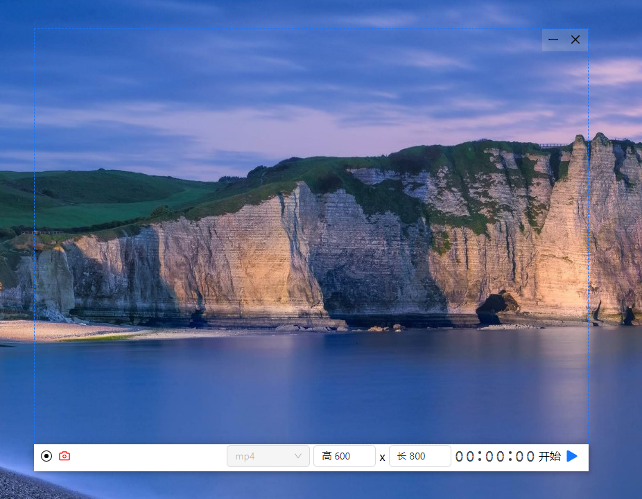
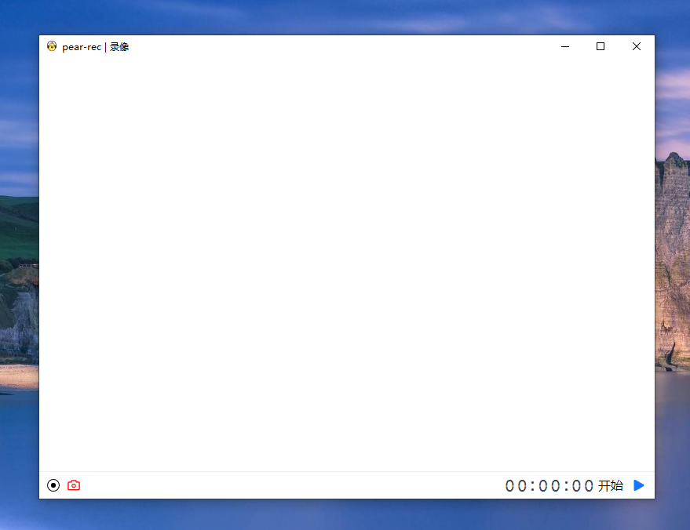
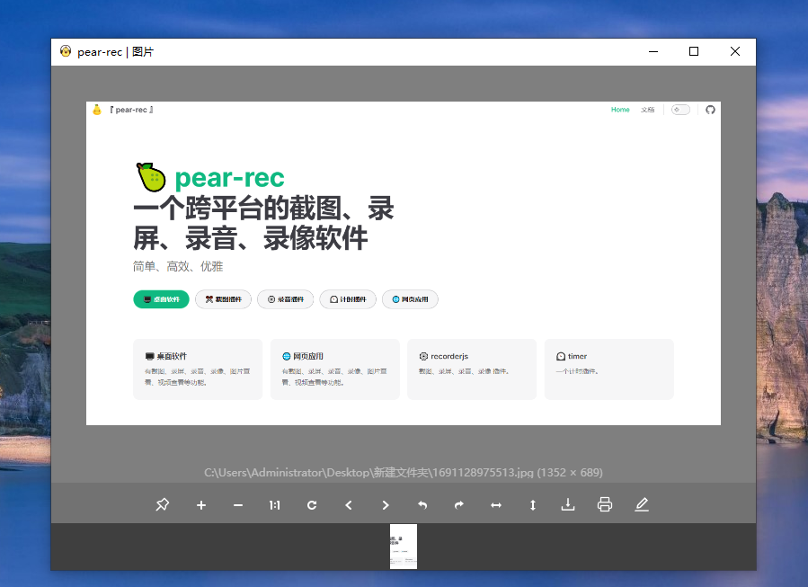

# pear-rec 例子

  

本页展示 pear-rec 的一些功能例子

这款软件具备卓越的屏幕录制能力，能够实现以下功能:

- **全高清截图**：捕捉每一刻，让每一次分享变得简单高效。
- **实时屏幕录制**：记录你的操作步骤或展示内容。
- **高质量音视频同步捕获**：录制音频和视频，保持同步。
- **动态 GIF 生成**：制作有趣的动画图像。
- **图片浏览**：方便地查看和管理你的图片文件。
- **视频播放**：播放视频文件，无需切换到其他应用程序。
- **音频回放**：听取录制的音频。
- **图像编辑**：编辑图片，添加标注、滤镜等。
- **视频转 GIF**：将视频文件转换为 GIF 格式，方便分享和使用。

## 架构

  

  

## 首页

  

## 截图

  

## 录屏

  

## 录音

  

## 录像

  

## 编辑图片

  

## 编辑 gif

  

## 查看图片

  

## 查看视频

  

## 查看音频

  

## 设置

  

